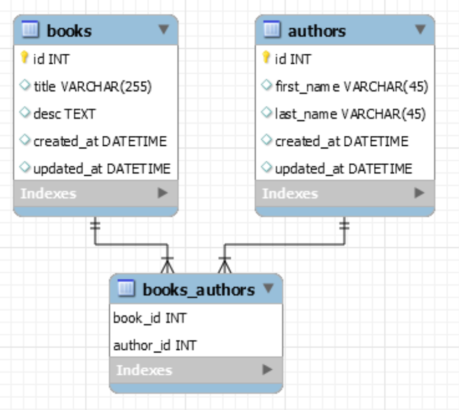
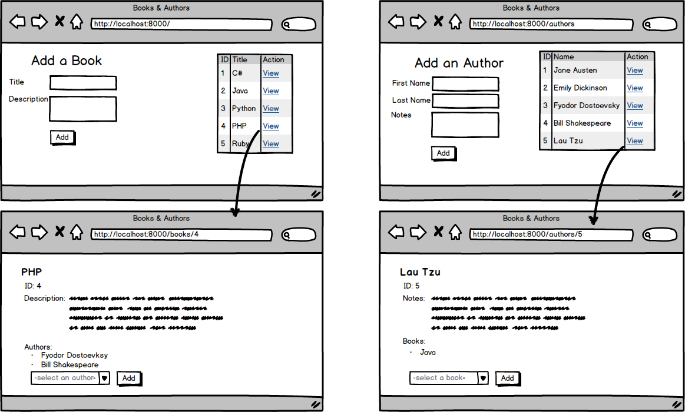

# Python_Books_Authors
A Python application to build a listing collection of books and their authors.

Tasks done:

- Create Book class model and Author class model per the below ERD

- [x] Add a template for creating books that also displays a table of all books in the database
- [x] Complete the route for adding a book to the database
- [x] Add a template that displays a specific book and its details, including all the authors associated with the given book
- [x] Create a form on the specific book template that has a dropdown of all the authors in the database. The "Add" button should add the selected author to the given book.
- [x] Add a template for creating authors that also displays a table of all authors in the database
- [x] Complete the route for adding an author to the database
- [x] Add a template that displays a specific author and its details, including all the books associated with the given author
- [x] Create a form on the specific author template that has a dropdown of all the books in the database. The "Add" button should add the selected book to the given author.
- [x] Have the dropdown menus only include authors or books not yet associated with the given book or author, respectively

